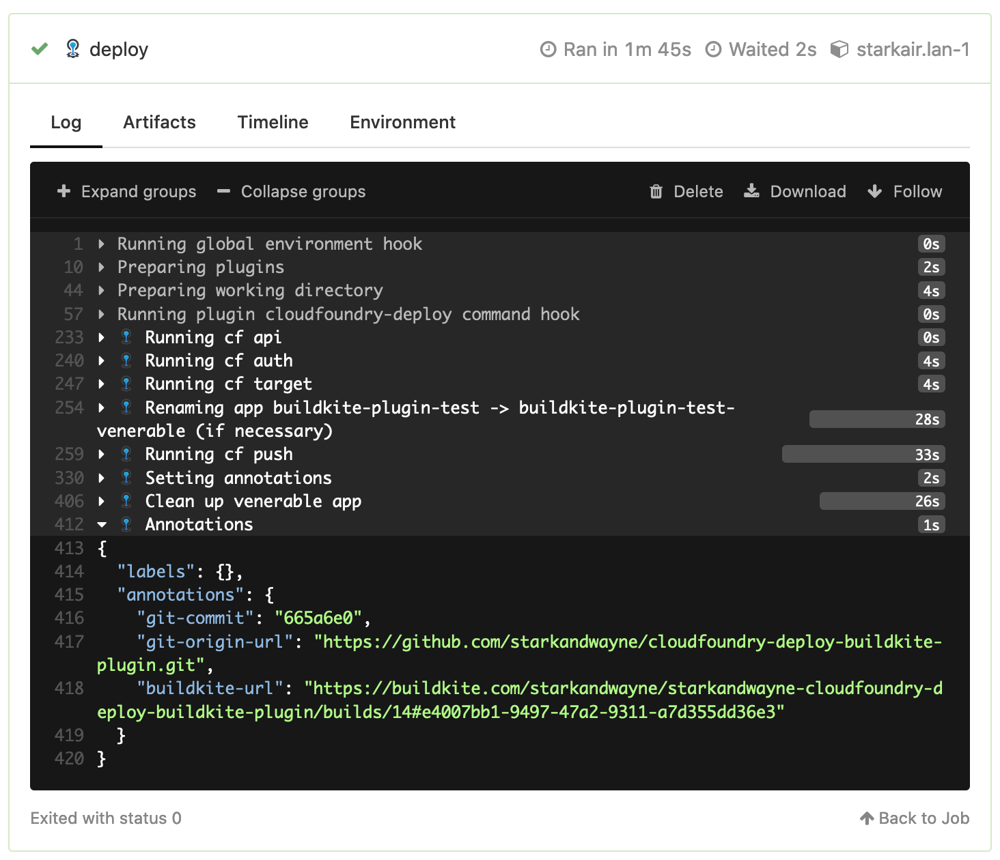

# Buildkite Plugin to Deploy to Cloud Foundry

This Buildkite Plugin will deploy an application contained within your repository to any Cloud Foundry with zero down time deployment.



The plugin will also annotate the deployment with references to the Git commit, the Git repo URL and the Buildkite URL that performed the deployment.

```json
$ cf curl /v3/apps/<GUID> | jq -r ".metadata"
{
  "labels": {},
  "annotations": {
      "git-commit": "cbb2295",
      "git-origin-url": "https://github.com/starkandwayne/cloudfoundry-deploy-buildkite-plugin.git",
      "buildkite-url": "https://buildkite.com/starkandwayne/starkandwayne-cloudfoundry-deploy-buildkite-plugin/builds/10#25c29a97-a498-418b-bab2-2fcbdf088137"
  }
}
```

## Usage

Sample usage with minimum required arguments:

```yaml
steps:
  - label: ":cloudfoundry: deploy"
    concurrency: 1
    concurrency_group: "cf-push"
    plugins:
      starkandwayne/cloudfoundry-deploy#v0.7.0:
        api: https://api.run.pivotal.io
        username: drnic@starkandwayne.com
        organization: starkandwayne
        space: buildkite-plugin-tests
        appname: buildkite-plugin-test
```

The `username` argument is optional, if you provide `$CF_USERNAME` via an agent hook.

You can provide the password via `$CF_PASSWORD` from an agent hook. If you provide the password via a different environment variable, then declare its name with `password_env` argument:

```yaml
steps:
  - label: ":cloudfoundry:"
    plugins:
      starkandwayne/cloudfoundry-deploy#v0.7.0:
        api: https://api.run.pivotal.io
        username: drnic@starkandwayne.com
        password_env: CF_PASSWORD_DRNIC
        organization: starkandwayne
        space: buildkite-plugin-tests
        appname: buildkite-plugin-test
```

The `cf push` command will look for `-f manifest.yml` by default. Use `manifest_path` argument to explicitly declare the location of the manifest.

```yaml
steps:
  - label: ":cloudfoundry:"
    plugins:
      starkandwayne/cloudfoundry-deploy#v0.7.0:
        api: https://api.run.pivotal.io
        username: drnic@starkandwayne.com
        organization: starkandwayne
        space: buildkite-plugin-tests
        appname: buildkite-plugin-test
        manifest_path: cf/manifest.yml
```

If you do not want zero downtime deployment, or want a faster deployment (again, without zero downtime deployment), then you can use `skip-zero-downtime: true` to disable it.

You can pass variables to your `manifest.yml` using the `vars` parameter. The value will be passed as `cf push --vars-file [vars contents]`. Note, the value of `vars` is a multi-line strong.

```yaml
steps:
  - label: ":cloudfoundry:"
    plugins:
      starkandwayne/cloudfoundry-deploy#v0.7.0:
        api: https://api.run.pivotal.io
        ...
        manifest_path: cf/manifest.yml
        vars: |
          some-var: 123
          build-number: $BUILDKITE_BUILD_NUMBER
```

## Testing

Test plugin using [buildkite-plugin-tester](https://github.com/buildkite-plugins/buildkite-plugin-tester):

```plain
docker run -v $(pwd):/plugin buildkite/plugin-tester:latest bats /plugin/tests

# or

docker-compose run tests
```
